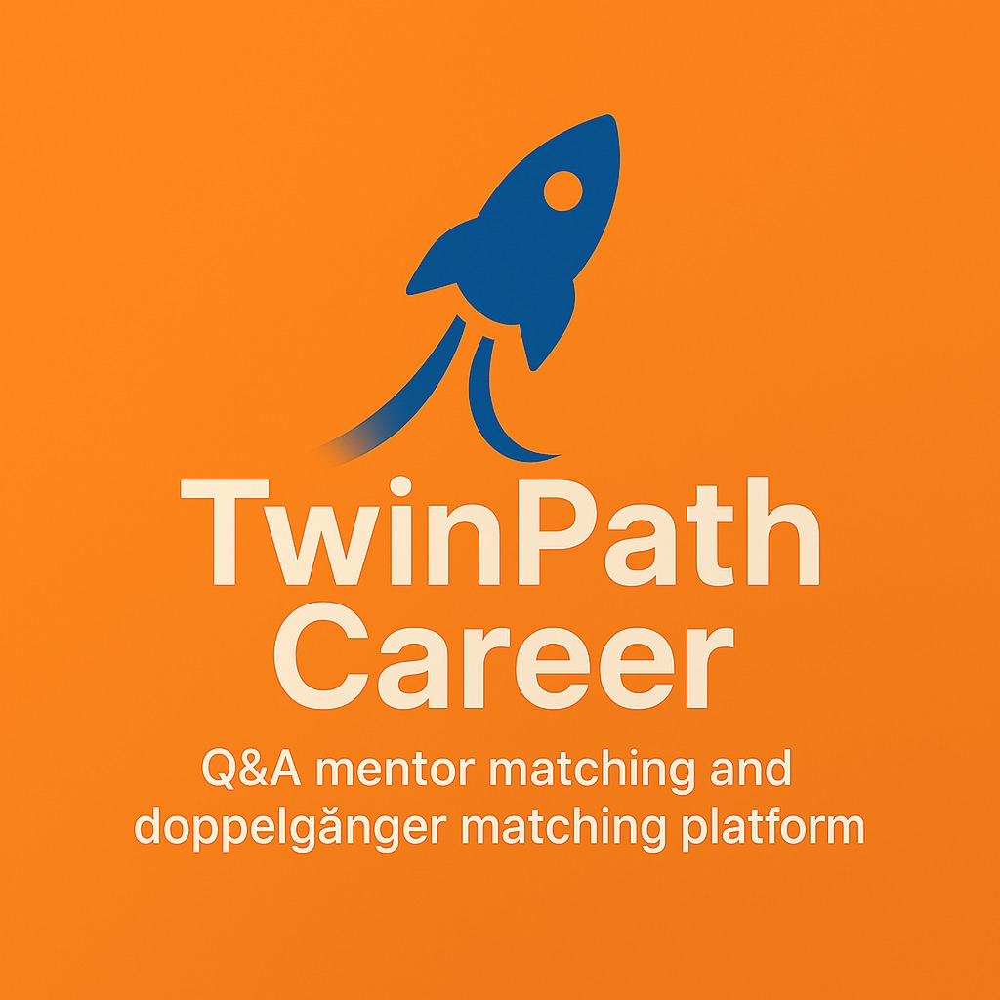

# Career Doppelgänger
<p align="center">
  
</p>
🚀 Career Doppelgänger is your personalized career assistant for Q&A, mentor matching, and doppelgänger matching — helping you find the right guidance and inspiration for your career journey.

---

## Features

- 🔥 **Personalized Career Q&A**  
  Get tailored answers to your career questions, powered by smart matching.

- 🧑‍🏫 **Mentor Matching**  
  Find mentors who align with your career goals, skills, and aspirations.

- 🧬 **Doppelgänger Matching**  
  Discover career paths and stories from people who are just like you.

- 📄 **Resume-Based Doppelgänger Search**  
  Upload your resume, and using your skills and experience, we'll match you with your career doppelgänger — someone whose path aligns closely with yours.

---
## How It Works

Career Doppelgänger integrates advanced AI models, resume parsing, and semantic search to deliver personalized career assistance through an interactive web interface. Here's a simplified overview of how the system operates:

- 🤖 **AI-Powered Career Q&A**  
  Users can ask natural language career-related questions. The system encodes the query, retrieves the most relevant profiles using a FAISS similarity index, and generates a context-aware response using a large language model (LLM). It remembers previous queries using a conversation history component for coherent dialogue.

- 🪞 **Doppelgänger Matching**  
  By entering basic information (title, skills, experience, industry), users are matched to similar professionals from a pre-embedded dataset. The system uses sentence embeddings and FAISS to find the closest career trajectories — acting as your professional "mirror."

- 📄 **Resume-Based Matching**  
  Users can upload a resume (PDF). The app extracts skills and experience, builds a custom career summary, and finds 2–3 profiles with similar skills and paths using embeddings.

- 🧑‍🏫 **Mentor Matching**  
  Based on your current role, goals, and learning interests, the app finds a mentor who has walked a similar path — especially useful for those looking to switch industries or upskill.

- ⚙️ **Under the Hood**  
  The app uses:
  - `SentenceTransformer` for semantic embeddings
  - `FAISS` for fast similarity search over thousands of career profiles
  - `Transformers` LLM (DeepSeek) for natural, context-rich responses
  - A resume parser to extract structured data from PDFs
  - `Gradio` for an interactive, user-friendly web interface

The system is modular and extensible — ideal for research, career platforms, or mentorship tools.


## Getting Started

1. **Clone the repository:**
   ```bash
   git clone https://github.com/Prayash-Das/Career-Doppelganger.git
   cd Career-Doppelganger
   ```

2. **Set up the Conda environment: Make sure you have Miniconda or Anaconda installed.**
   Create the environment using the provided YAML file:
   ```bash
   conda env create -f faiss_gpu_env.yml -n faiss_gpu_env_clone
   conda activate faiss_gpu_env_clone
   ```

3. **Install dependencies:**
   ```bash
   npm install
   ```

4. **Run the app:**
   ```bash
   npm start
   ```
   (Adjust based on your tech stack.)

---

## Powered By

- 🧠 **LLM Model: DeepSeek LLM 7B Chat**  
  A powerful large language model developed by DeepSeek, designed to understand complex queries, generate human-like responses, and provide insightful answers. It powers the smart, conversational Q&A and career guidance capabilities of Career Doppelgänger.

- 🧩 **Embedding Model: BGE Base EN v1.5**  
  Developed by BAAI, this state-of-the-art embedding model transforms text into rich, meaningful vector representations. It enables deep semantic matching between users, mentors, and career paths, making personalized recommendations highly accurate and relevant.

- 💻 **Compute Infrastructure: Jarvis HPC Cluster at Stevens Institute of Technology**  
  All models and processing pipelines were developed and tested on **Jarvis**, Stevens' High Performance Computing Cluster, featuring:
  - 46 servers with 2,752 CPU cores  
  - 14 TB of memory  
  - Over 150 teraflops of compute power  
  - HDR 100 Infiniband interconnects  
  - 1.2 PB of storage  
  - Integrated GPUs for accelerated deep learning tasks

These resources ensure fast, reliable model training, embedding generation, and large-scale data processing.

---

## Contributing

We welcome contributions! 🚀  
Please read our [CONTRIBUTING.md](CONTRIBUTING.md) to get started.

### Steps:

1. Fork the repo.
2. Create a new branch:
   ```bash
   git checkout -b feature-branch
   ```
3. Make your changes.
4. Push to your branch.
5. Open a Pull Request.

---

## License

This project is licensed under the [Apache License 2.0](LICENSE).  
See the `LICENSE` file for full details.

